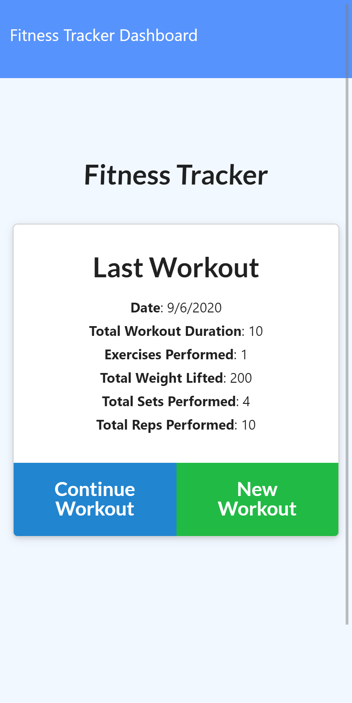
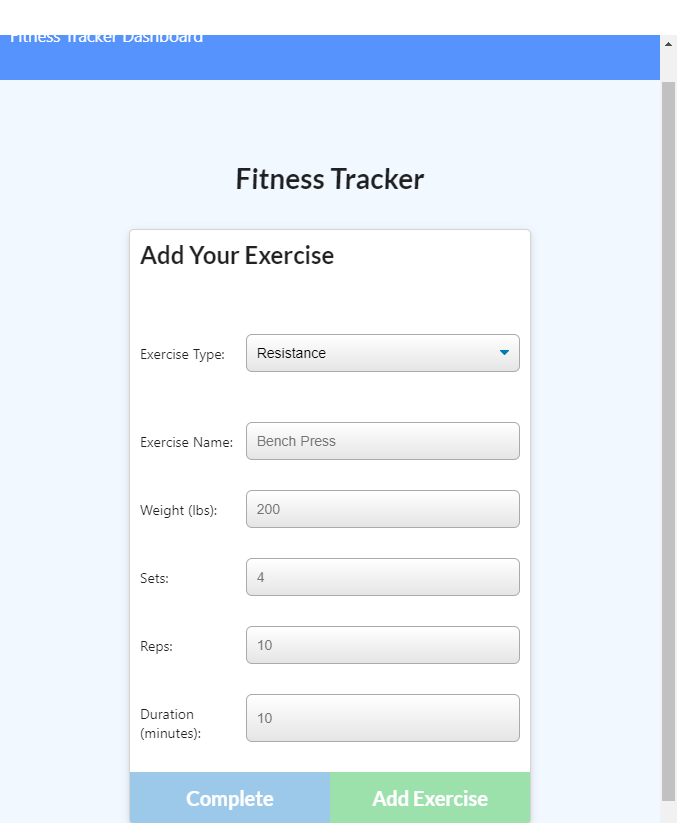
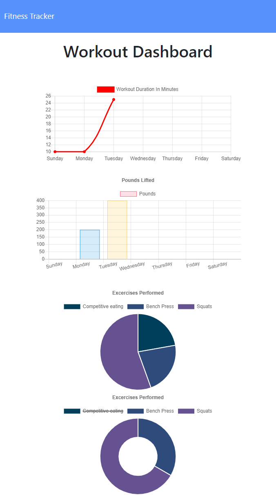

# Fitness tracker
## Description
An app to help keep track of your fitness journey.  

## Table of Contents
1. [Dependencies](#Dependencies)
2. [Usage](#Usage)
3. [License](#License)
4. [Questions](#Questions)
## Dependencies
This app uses Node.js, mongoose for MongoDB, express for the server logic and morgan for logging.
## Usage
Navigate to https://andrew-fit.herokuapp.com
## Screenshots

## License
This project uses a MIT license.
## Tests
There are tests for the mongoose Schema and the express routes
## Questions
You can find my github account at
[andrew836-dev](https://github.com/andrew836-dev)  
Or you can email me andrew.aj.gray@gmail.com
